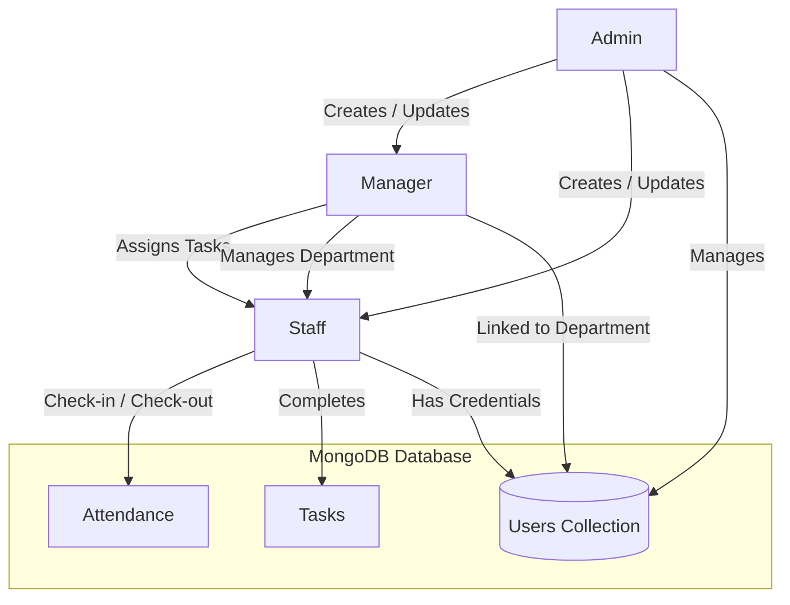
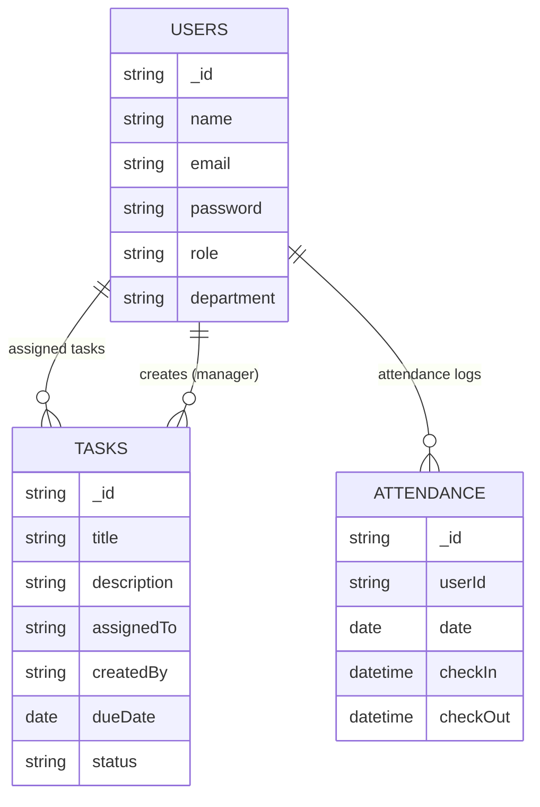
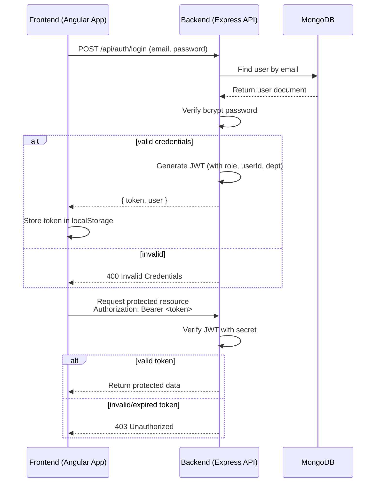
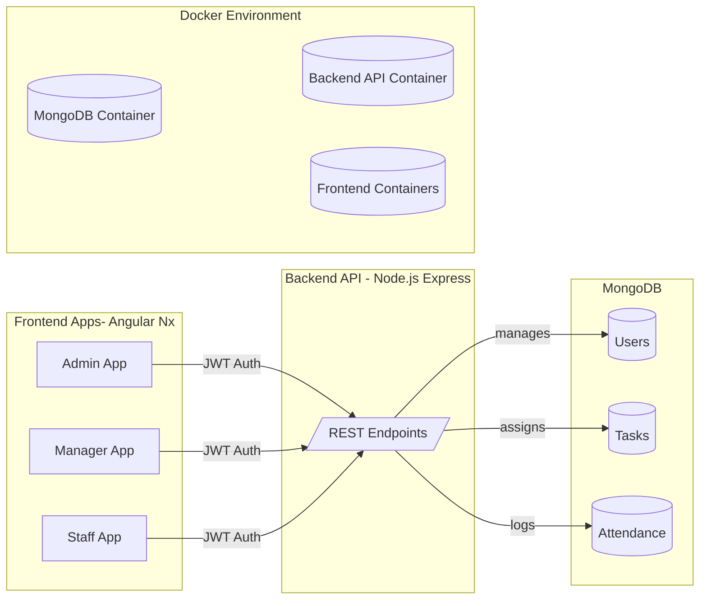

# 🏢 Backoffice System (Admin / Manager / Staff)

A role-based backoffice system built with **Nx Workspace**, **Angular Standalone**, **Node.js (Express)**, and **MongoDB**.  
The system supports **Admin**, **Manager**, and **Staff** roles with different permissions.


## ✨ Features

### 🔑 Authentication & Authorization
- JWT-based authentication
- Role-based access control (Admin / Manager / Staff)
- Login pages for each role
- Angular route guards + backend middleware for extra security

### 👩‍💼 Roles
- **Admin**
  - Create, update, delete managers and staff
  - Manage all users
- **Manager**
  - Assigned by department
  - Assign tasks to staff
  - Manage staff in their department
- **Staff**
  - Check-in and check-out attendance
  - View and complete assigned tasks

### 🛠️ Tech Stack
- **Frontend:** Angular Standalone (Nx), TailwindCSS, Angular Material (optional)
- **Backend:** Node.js, Express.js
- **Database:** MongoDB (Mongoose)
- **Workspace:** Nx Monorepo
- **Deployment:** Docker (Docker Compose)


## 📂 Project Structure
```
backoffice-system/
├── apps/
│ ├── admin/ # Angular Admin App
│ ├── manager/ # Angular Manager App
│ ├── staff/ # Angular Staff App
│ └── backend/ # Node.js Express API
├── libs/
│ ├── api-client/ # Angular services & guards
│ └── ui-auth/ # Shared UI auth components (login, logout, unauthorised)
├── docker-compose.yml # Docker services
└── README.md
```

## ⚡ Getting Started

### 1. Clone the Repo
```bash
git clone https://github.com/sachinksamad1/backoffice-system.git
cd backoffice-system
```

### 2. Install Dependencies
```
npm install
```

### 3. Environment Variables
Create apps/backend/.env:
```
MONGO_URI=mongodb://127.0.0.1:27017/login-system
JWT_SECRET=supersecretkey123
JWT_EXPIRES_IN=1d
```

## ▶️ Running the Project
Run Backend (without Docker)
```
npm run start:backend
```
Server runs at: http://localhost:3000

Server runs at: http://localhost:3000

Run Frontend Apps
```
npx nx serve admin
npx nx serve manager
npx nx serve staff
```
Each runs on a separate port (4200, 4201, 4202 by default).

## 🐳 Run with Docker
🐳 Run with Docker
Start Services
```
docker-compose up --build
```

Stop Services
```
docker-compose down
```

## 🌱 Seeding Users
Seed Script
```
npm run seed:users
```

Creates:
- Admin: admin@example.com / password123

- Managers: sales.manager@example.com / password123, etc.

- Staff: sales.staff1@example.com / password123, etc.

## 🔎 Testing API
Login (Admin)
```
POST http://localhost:3000/api/auth/login
Content-Type: application/json

{
  "email": "admin@example.com",
  "password": "password123"
}
```

Staff Check-in
```
POST http://localhost:3000/api/staff/attendance/checkin
Authorization: Bearer <JWT_TOKEN>
```
### 👉 Full API test requests available in `apps/backend/backend.http` (use with VS Code REST Client extension).

## 🗂️ Role-Based Workflow Diagram

### 🔎 Projet Explanation
- Admin
    - Creates/updates Managers and Staff in Users collection
  
- Manager
    - Belongs to a department
    - Assigns tasks to staff in their department
  
- Staff
    - Logs attendance (check-in/out)
    - Views/completes assigned tasks
  
- Database
    - Users, Tasks, and Attendance collections link everything together

## 🗄️ Database Schema (ERD)

### 🔎 Explanation
- USERS Collection
    - Stores Admin, Manager, and Staff
    - Role field determines permissions
    - Department links Managers and Staff

- TASKS Collection
    - Each task is created by a Manager
    - Each task is assigned to a Staff user
    
- ATTENDANCE Collection
    - Each record belongs to a Staff user
    - Stores daily check-in and check-out times

## 🔑 Authentication Flow (JWT)


### 🔎 Explanation
 - User Login
    - Angular app sends email/password to backend
    Backend validates against MongoDB using bcrypt

- Token Issuance
    - If valid → backend signs a JWT with role + userId + department
    - Token is sent to frontend, stored in localStorage
      
- Protected Routes
    - Frontend attaches token in Authorization: Bearer <token>
    - Backend middleware verifies signature with JWT_SECRET
      
- Access Control
    - If token valid → proceed to route
    - If token invalid/expired → return 401/403

## 🏗️ System Architecture


### 🔎 Explanation
- Frontend Apps (Nx Angular)
    - admin/, manager/, and staff/ are separate Angular apps in one Nx workspace
    - Each app has its own login & role-specific dashboard
  
- Backend (Node.js Express)
    - Handles authentication, role-based access, and routes for Admin, Manager, and Staff
    - Issues JWT tokens for secure communication
  
- Database (MongoDB)
    - Users collection stores Admin, Manager, and Staff
    - Tasks collection stores manager-assigned work for staff
    - Attendance collection stores staff check-in/out logs
  
- Docker (Optional)
    - Provides isolated containers for Backend, Frontend apps, and MongoDB
    - Managed via docker-compose.yml

## 📌 Roadmap

  - Add refresh tokens

 - Add email/password reset

 - Add dashboards with charts (Angular Material)

 - Add audit logs

## 🤝 Contributing
Pull requests are welcome!
For major changes, open an issue first to discuss what you’d like to change.

📜 [License](LICENSE)

MIT © 2025 SACHIN KUMAR SAMAD
---

